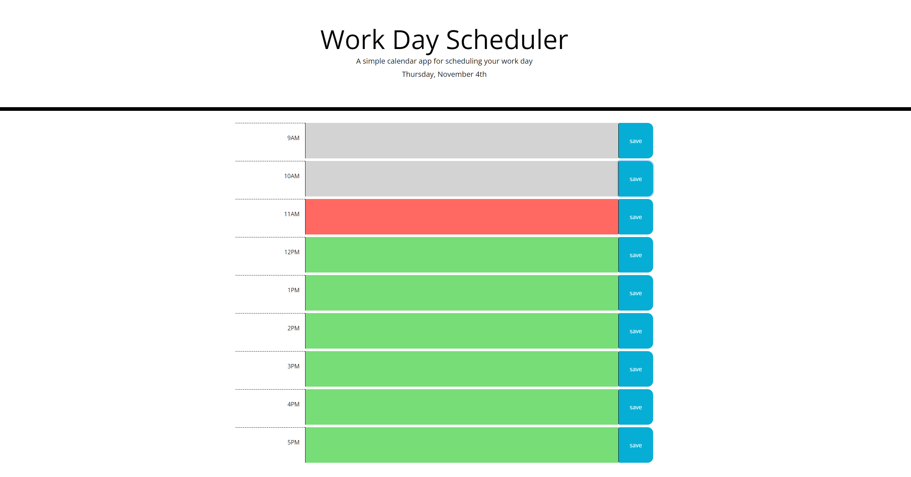

# Work Day Scheduler Starter Code
Workday Scheduler is a simple daily calendar application that lets the user plan their day by the hour. It includes a color-coded feature that displays what hours have passed, what hour it currently is, and what hours have yet to come. This application uses localStorage so that the users tasks will be saved for them.

For this challenge, I worked with Bootstrap in order to satisfy the CSS styling that the starter-code gave me. In order to personalize anything without changing the given CSS, I relied on implementing Bootstrap classes in html. In order to create the required functionality of this challenge, I used jQuery and Moment.js. 

The most challenging part of this project was familiarizing myself with Moment.js. It took the longest time to understand the documentation enough to implement it the way I needed for this project, but it was good practice for reading documentation.

### Start planning your day with this project [here](https://adairconlin.art/workday-scheduler/)

